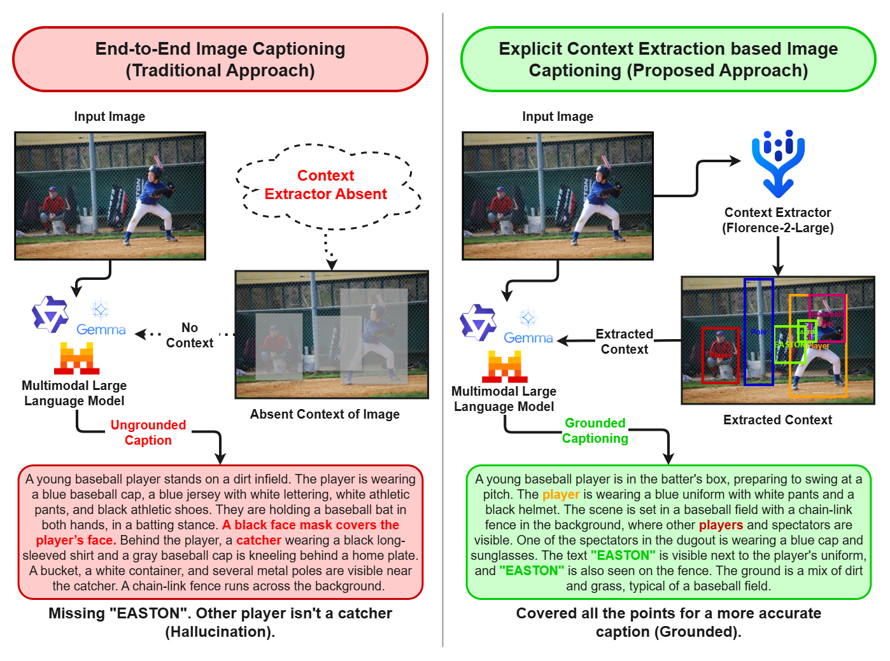

# See, Read, Describe: Entity-Grounded Captioning with Multimodal LLMs
<p align="center">
  <a href="https://github.com/DeepLumiere/SRD2026">
    
  </a>
  <a href="https://opensource.org/licenses/MIT">
    
  </a>
  <a href="https://www.python.org/downloads/">
    
  </a>
  <a href="https://pytorch.org/">
    
  </a>
</p>

## Overview
This repository contains the official implementation of **"See, Read, Describe: Entity-Grounded Captioning with Multimodal LLMs"**, submitted to GRAIL-CVPR 2026.
**Abstract**: Multimodal Large Language Models (MLLMs) have achieved remarkable linguistic and visual fluency, yet they are prone to hallucinating textual content in natural scenes due to weak visual grounding. In this paper, we investigated the efficacy of traditional end-to-end inference in text-rich environments with a staged reasoning framework that decouples perception from narrative generation. By evaluating three open-source MLLMs, namely: Gemma3-12B, Ministral3-8B, and Qwen2.5-VL-7B, we quantified the performance gains achieved when images are assisted with explicit context extracted using the off-the-shelf Florence-2-large model. We observed that explicit context extraction before captioning yields a 2-fold increase in Grounding IoU and OCR Recall across most architectures. Further, through blind human evaluation, we observed gains in quality/coverage of captions, while reducing the hallucination rate. It also revealed critical insight, like overloading of context in Gemma3-12B degraded performance, which we conclude by proposing saliency-based filtering for future work.


## Key Features

- **Entity-Grounded Captioning**: Novel approach for generating descriptions grounded on explicitly extracted entities
- **Reproducible Results**: Full inference and evaluation code provided

## Quick Start

Follow this workflow to compare "Blind" (Image-only) vs. "Grounded" (Image + Context) captioning using the included example.

### Prerequisites
- **Python 3.13+**
- **Ollama**: Required for running the local LLM (e.g., Ministral-8B). [Install Ollama](https://ollama.com).
- **GPU**: Recommended for Florence-2 context extraction (auto-detected).

### 1. Extract Visual Context
First, run Florence-2 to extract objects and text from the image. This creates the grounding data required for the "Describe" stage.

```bash
# Run from repository root
python scripts/context_extractor.py example_resources/sample_image.jpg
```
*Output: Generates `example_resources/florence2_output.json` containing detected bounding boxes and OCR text.*

### 2. Generate Captions (Blind vs. Grounded)
Run the interface to generate captions. The script automatically runs an A/B test:
1.  **Blind Inference**: Asks the LLM to describe the image without external info.
2.  **Grounded Inference**: Injects the JSON context from Step 1 into the prompt.

```bash
# Run from repository root
python scripts/caption_interface.py
```
*Note: The script will automatically attempt to pull the necessary Ollama model (e.g., `ministral-3:8b`) if missing.*

### Troubleshooting
- **Missing dependencies**: The scripts contain auto-installers. If a script fails, simply re-run the command; it will install missing packages and restart.
- **Ollama connection**: Ensure `ollama serve` is running in a separate terminal if the script fails to start it automatically.

## Example


Context Extracted:
```json
{
  "source": "../example_resources/sample_image.jpg",
  "results": {
    "Object Detection": {
      "bboxes": [
        [
          0.5120000243186951,
          0.3840000033378601,
          1023.488037109375,
          767.6160278320312
        ]
      ],
      "labels": [
        "whiteboard"
      ]
    },
    "OCR": "Inside chip?\nPullup Resistor\nVariable\nResistor\nResensor Pin\n"
  }
}
```
Image-Only Caption:
```
The image depicts a whiteboard or similar surface with handwritten annotations in green marker.

The text visible in the image includes:

- "Variable Resistor" written vertically on the right side.
- "Sensor pin" written near the top center.
- "Pin" written twice near the sensor pin label.
- "Crude Resistor" written twice, once near the middle left and once near the top left.
- "Crude Chip" written near the middle left.
- "Variable Resistor" is also partially visible near the top center, connected to the line leading to "Sensor pin".

The drawing includes simple line diagrams connecting these labels, likely representing a circuit or component layout. The lines appear to be hand-drawn with arrows indicating connections
```
Grounded Caption:
```
The image depicts a section of a whiteboard with handwritten annotations in green marker. Visible text includes the phrases "Inside chip?" followed by "Pullup Resistor," "Variable Resistor," and "Resensor Pin," each written in a cursive or informal handwriting style. The lines and arrows appear to illustrate connections or relationships between these components.
```
## Citation
If you find this work useful for your research, please cite:
```bibtex
YET TO PUBLISH
```
## License

This project is licensed under the MIT License - see the [LICENSE](LICENSE) file for details.


**Note**: This code is associated with a paper submitted to GRAIL-CVPR 2026. Full details will be available upon publication.